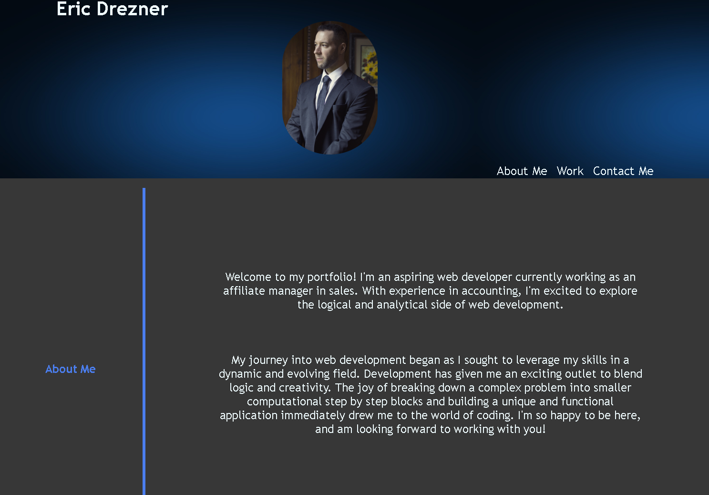

# Portfolio

## Description

This app serves as a portfolio for some of my completed projects.

The layout contains a header with navigation links, an about me, work, and contact page.

Website, Repository and Preview Image:

[Website](https://edrezner.github.io/Portfolio/)

[GitHub Repo](https://github.com/edrezner/Portfolio)

## Usage

Navigation links are within the header that can be used to move between the different sections.

Links to all project pages are accessed when clicking image. The contact section includes links to my GitHub and email.
